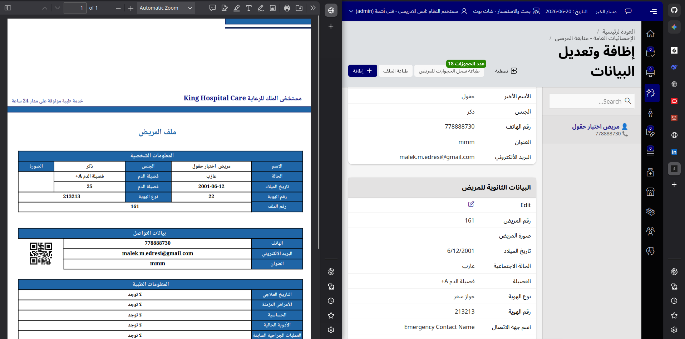
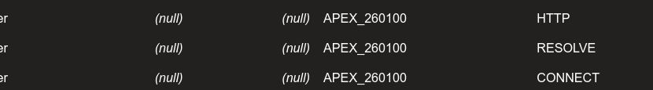
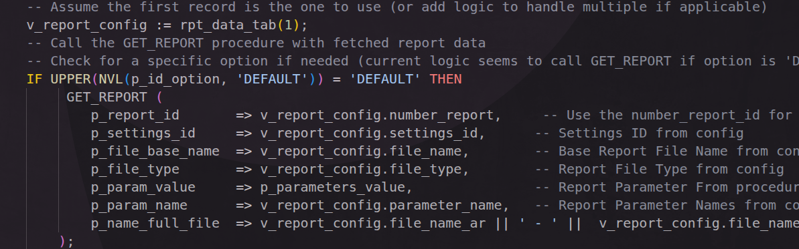

# Oracle APEX + JasperReports Integration for Oracle Database 26ai

A robust, production-ready integration framework for generating high-quality PDF/Excel reports from Oracle APEX using JasperReports Server. This project is specifically designed and tested with Oracle Database 26ai Free and Oracle REST Data Services (ORDS).



## Features

- **Seamless APEX Integration**: Generate and download JasperReports directly from APEX pages using native PL/SQL and `APEX_WEB_SERVICE`.
- **Dockerized Environment**: Includes a complete, out-of-the-box `docker-compose.yml` stack featuring Oracle DB 26ai, ORDS, JasperReports Server, and MariaDB.
- **Enterprise-Grade Logging & Error Handling**: Comprehensive logging mechanisms catching detailed HTTP response errors and network issues.
- **Multi-Tenant Support**: Built-in logic to pass schema contexts dynamically to JasperReports for multi-tenant applications.
- **Modern Standards**: Sanitized PL/SQL codebase removing hardcoded credentials, optimized for modern AL32UTF8 character sets.

## Repository Structure

- `docker/` - Docker Compose stack for the complete environment.
- `database/` - Table structures, types, and seed data.
- `install/` - Master installation scripts.
- `packages/` - Core PL/SQL logic (`JASPER_REPORT_PKG` and `REPORT_ERROR_LOG_PKG`).
- `scripts/` - Network ACL grants and privilege synchronization.
- `docs/` - Detailed architectural diagrams and documentation.
- `examples/` - Example APEX page process implementations.

## Architecture

This project uses a REST-based architecture to connect Oracle Database and JasperReports Server. 

For detailed sequence diagrams, network topologies, and URL structures, please refer to the [Architecture Documentation](docs/architecture.md).

## Getting Started

### 1. Run the Docker Stack
Copy the `.env.example` file to `.env` and start the containers.

```bash
cd docker
cp .env.example .env
docker-compose up -d
```
*(Wait 10-15 minutes for the Oracle Database to initialize for the first time)*

### 2. Configure Database ACLs
Oracle requires explicit network permissions to communicate with external servers. Run the ACL grants as `SYSDBA`:

```bash
sqlplus sys/password@//localhost:1521/FREEPDB1 as sysdba
@scripts/acl/grant_acl.sql
```



### 3. Install Application Schema Objects
Run the master installation script as your APEX application schema owner:

```bash
sqlplus your_schema/password@//localhost:1521/FREEPDB1
@install/install_all.sql
```

## Usage in Oracle APEX

Once installed, generating a report from an APEX page process is as simple as calling the core package.

**Example: Page Process (PL/SQL Code)**
```sql
BEGIN
    jasper_report_pkg.get_report(
        p_settings_id     => 1,                          -- Server Configuration ID
        p_file_base_name  => 'patient_profile',          -- JRXML template name
        p_file_type       => 'pdf',                      -- Output format (pdf, xlsx, etc.)
        p_param_name      => 'P_PATIENT_ID',             -- JasperReports Parameter
        p_param_value     => :P1_PATIENT_ID,             -- APEX Item Value
        p_output_filename => 'Patient_Profile_' || :P1_PATIENT_ID
    );
END;
```



For more complex examples including multiple parameters or different output formats, please check the [Examples directory](examples/).

## Security & Best Practices
- **Network ACLs**: Only grant access to the specific IP/Hostname of the JasperReports server.
- **Database Grants**: Ensure your JasperReports database user has `READ ONLY` access to the required views.
- **Exception Handling**: Check the `REPORT_LOG` table if report generation fails to get detailed HTTP error codes.

## Contributing
Please see the [CONTRIBUTING.md](CONTRIBUTING.md) and [CODE_OF_CONDUCT.md](CODE_OF_CONDUCT.md) files for details on our code of conduct and the process for submitting pull requests to us.

## License

This project is licensed under the [MIT License](LICENSE).
