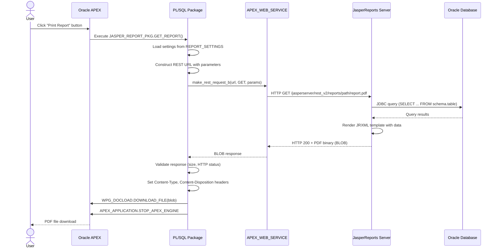
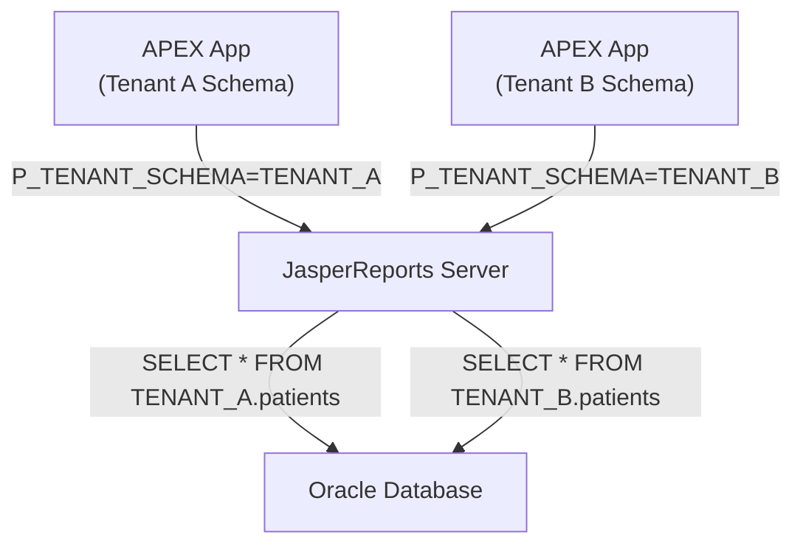

# Architecture

This document explains how Oracle APEX communicates with JasperReports Server to generate PDF reports.

## Overview

The integration follows a simple **REST-based architecture**. When a user clicks a "Print" button in Oracle APEX, the application calls a PL/SQL procedure that sends an HTTP request to JasperReports Server. JasperReports generates the report and returns it as a binary file (PDF, Excel, etc.), which is then streamed directly to the user's browser.

## Data Flow

```
┌──────────────┐     ┌──────────────┐     ┌────────────────────┐     ┌──────────────────┐
│              │     │              │     │                    │     │                  │
│  User clicks │────▶│  Oracle APEX │────▶│  PL/SQL Package    │────▶│  JasperReports   │
│  "Print"     │     │  Page        │     │  (GET_REPORT)      │     │  Server          │
│  button      │     │  Process     │     │                    │     │  (REST API)      │
│              │     │              │     │                    │     │                  │
└──────────────┘     └──────────────┘     └────────┬───────────┘     └────────┬─────────┘
                                                   │                          │
                                          Uses APEX_WEB_SERVICE      Queries Oracle DB
                                          to make HTTP GET           via JDBC to fetch
                                          request with               report data
                                          parameters
                                                   │                          │
                                                   │     ┌──────────────┐     │
                                                   │     │              │     │
                                                   └────▶│  PDF / BLOB  │◀────┘
                                                         │  Response    │
                                                         │              │
                                                         └──────┬───────┘
                                                                │
                                                     Streamed to browser
                                                     via WPG_DOCLOAD
```

## Sequence Diagram



## Component Details

### Oracle APEX (Frontend)

- Provides the user interface (buttons, forms, page items)
- Passes parameter values (patient ID, date range, etc.) to PL/SQL
- Handles the HTTP response headers and file download

### PL/SQL Package — JASPER_REPORT_PKG

- Reads server settings from `REPORT_SETTINGS` table
- Constructs the JasperReports REST API URL
- Calls `APEX_WEB_SERVICE.MAKE_REST_REQUEST_B` to fetch the report as a BLOB
- Validates the response (HTTP status code, BLOB size)
- Sets HTTP headers and streams the file to the browser
- Logs errors and successes to `REPORT_LOG` table

### APEX_WEB_SERVICE

- Oracle APEX built-in package for making HTTP/HTTPS calls
- Handles Basic Authentication (username/password)
- Passes query parameters automatically
- Returns the response as a BLOB for binary content

### JasperReports Server

- Receives REST API requests from Oracle Database
- Authenticates the request (Basic Auth)
- Loads the JRXML report template
- Connects to Oracle Database via JDBC to execute the report query
- Renders the report and returns the binary output (PDF, Excel, CSV)

### Oracle Database

- Stores the application data queried by JasperReports
- Stores report configuration (REPORT_SETTINGS, REPORT_CONFIG)
- Provides network access via ACL grants (DBMS_NETWORK_ACL_ADMIN)
- Hosts the PL/SQL integration packages

## Network Topology (Docker)

```
┌─────────────────────────────────────────────────────────────┐
│                    jasper-network (Docker bridge)            │
│                                                             │
│  ┌──────────────┐    ┌──────────┐    ┌──────────────────┐  │
│  │  oracle-db    │    │  ords    │    │  jasper-server    │  │
│  │  :1521        │◀──▶│  :8080   │    │  :8080            │  │
│  │              │    │          │    │                    │  │
│  │  Oracle DB   │◀───────────────────│  JDBC connection   │  │
│  │  26ai Free   │    │  APEX    │    │  (report queries)  │  │
│  └──────────────┘    └──────────┘    └──────────────────┘  │
│         ▲                                     ▲             │
│         │              HTTP GET               │             │
│         └─────── APEX_WEB_SERVICE ────────────┘             │
│                  (report request)                            │
│                                                             │
│  ┌──────────────┐                                           │
│  │  jasper-db    │◀──── JasperReports metadata storage      │
│  │  MariaDB      │                                           │
│  │  :3306        │                                           │
│  └──────────────┘                                           │
│                                                             │
│  External Ports:                                            │
│    :1521 → Oracle DB     (development only)                 │
│    :8181 → ORDS/APEX     (user access)                      │
│    :8383 → JasperReports (admin panel)                      │
└─────────────────────────────────────────────────────────────┘
```

## URL Structure

JasperReports REST API URL format:

```
{protocol}://{hostname}:{port}/jasperserver/rest_v2/reports{base_path}{filename}.{format}
```

Example:
```
http://jasper-server:8080/jasperserver/rest_v2/reports/reports/medical/patient_profile.pdf?P_PATIENT_ID=101&P_TENANT_SCHEMA=MY_SCHEMA
```

| Component | Source | Example |
|-----------|--------|---------|
| Protocol | `REPORT_SETTINGS.PROTOCOL` | `http` |
| Hostname | `REPORT_SETTINGS.HOSTNAME` | `jasper-server` |
| Port | `REPORT_SETTINGS.PORT` | `8080` |
| Base Path | `REPORT_SETTINGS.BASE_REPORT_PATH` | `/reports/medical/` |
| File Name | `p_file_base_name` parameter | `patient_profile` |
| Format | `p_file_type` parameter | `pdf` |
| Parameters | `p_param_name` / `p_param_value` | `P_PATIENT_ID=101` |

## Multi-Tenant Support

The integration supports multi-tenant architectures where each tenant has its own Oracle schema:

1. `JASPER_REPORT_PKG.GET_REPORT` automatically detects the current schema using `SYS_CONTEXT('USERENV', 'CURRENT_SCHEMA')`
2. It appends `P_TENANT_SCHEMA` as a parameter to the JasperReports REST call
3. The JRXML report template uses `$P{P_TENANT_SCHEMA}` to query the correct tenant's data
4. The JasperReports database user (`JASPER_READ_ROLE`) has SELECT grants on all tenant views


